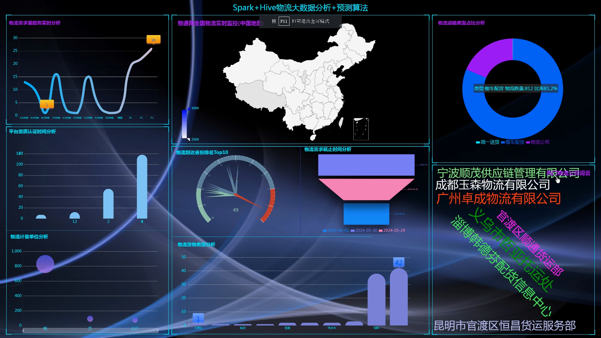
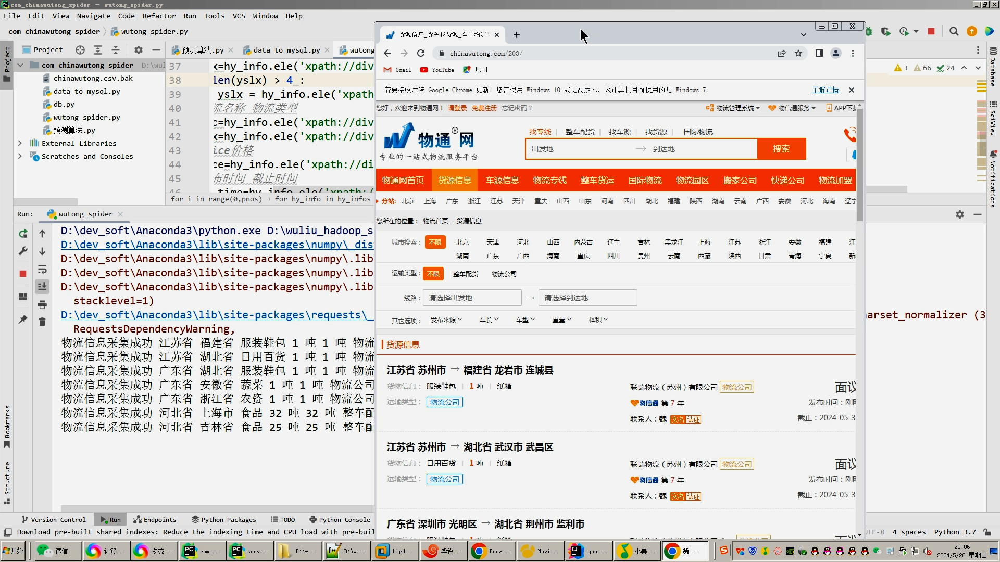
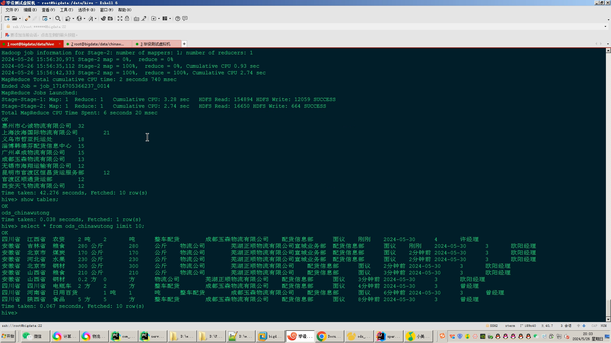
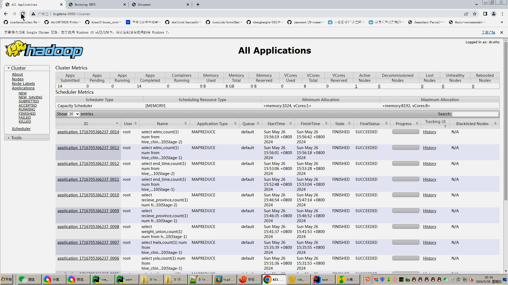
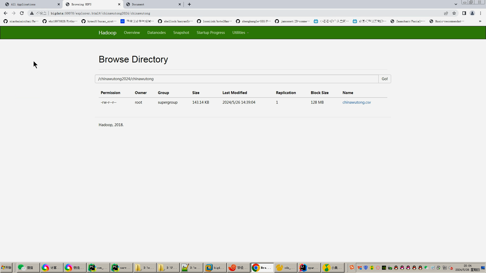
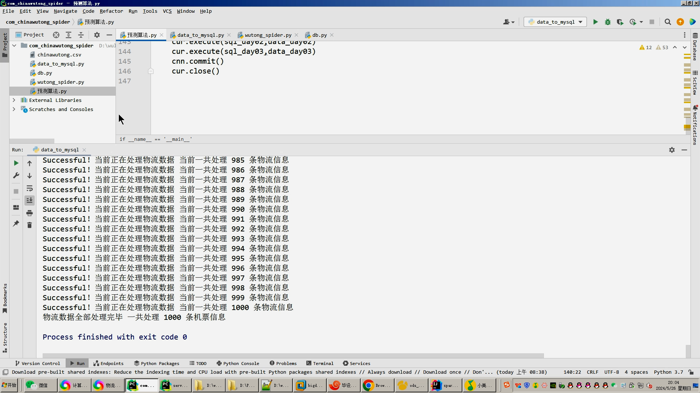
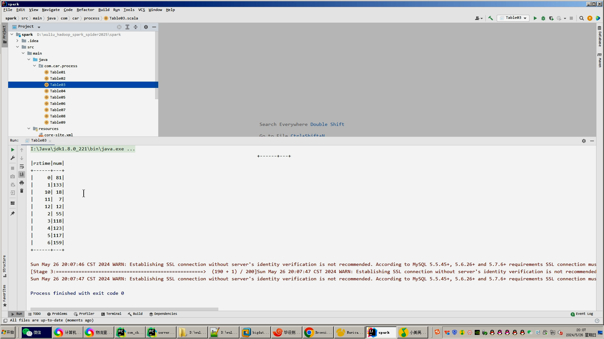
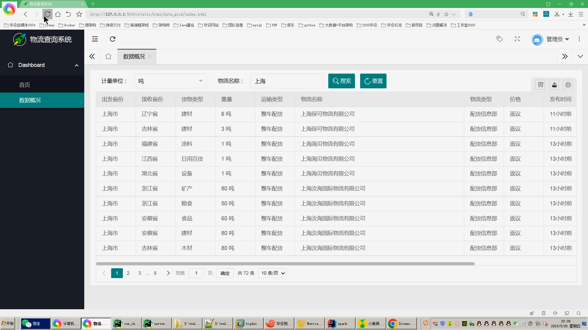
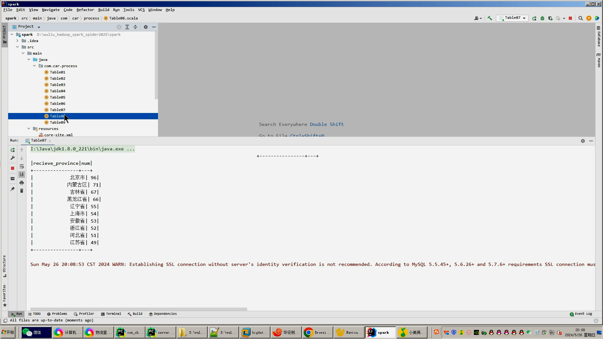

## 计算机毕业设计吊炸天hadoop+spark+hive物流大数据分析平台 物流预测系统 物流信息爬虫 物流大数据 机器学习 深度学习 知识图谱 大数据 大数据毕设 深度学习 机器学习 大数据 大数据毕业设计 机器学习 预测系统 数据仓库 大数据毕业设计 文本分类 LSTM情感分析 大数据毕业设计 知识图谱 大数据毕业设计 预测系统 实时计算 离线计算 数据仓库 人工智能 神经网络

## 要求
### 源码有偿！一套(论文 PPT 源码+sql脚本+教程)

### 
### 加好友前帮忙start一下，并备注github有偿hive物流数仓+预测
### 我的QQ号是2827724252或者798059319或者 1679232425或者微信:bysj2023nb

# 

### 加qq好友说明（被部分 网友整得心力交瘁）：
    1.加好友务必按照格式备注
    2.避免浪费各自的时间！
    3.当“客服”不容易，repo 主是体面人，不爆粗，性格好，文明人。

演示视频如下：

https://www.bilibili.com/video/BV14x4y1p7n8/?spm_id_from=333.999.0.0

## 开发技术：
spark hadoop hive 装杯显摆虚拟机Linux敲命令炫酷吊打 flask echarts sqoop scala hdfs yarn mysql python爬虫框架等；

## 流程： 

1.Python爬虫采集物流数据等存入mysql和.csv文件；
2.使用pandas+numpy或者MapReduce对上面的数据集进行数据清洗生成最终上传到hdfs；
3.使用hive数据仓库完成建库建表导入.csv数据集；
4.使用hive之hive_sql进行离线计算，使用spark之scala进行实时计算；
5.将计算指标使用sqoop工具导入mysql；
6.使用Flask+echarts进行可视化大屏实现、数据查询表格实现、含预测算法；

## 创新点：
1.Python爬虫采集海量数据；

2.卷积神经网络KNN CNN RNN预测算法；

3.spark实时分析+(hadoop、hive离线分析数据仓库)双实现，可实时可离线防止导师喷人,干死中国死全家杂种导师喷天喷地死他妈逼去吧；

4.可视化大屏炫酷显摆；

## 干死中国导师王八杂种玩意，天天炸片国家补贴，技术为0，吹牛逼第一靠狗一样的存在
##  他妈比做个毕设杂种导师喷天喷地司马绝种一样 操他妈逼死他妈逼杂种中国狗导师靠狗一样！

## 演示视频

https://www.bilibili.com/video/BV14x4y1p7n8/?spm_id_from=333.999.0.0

